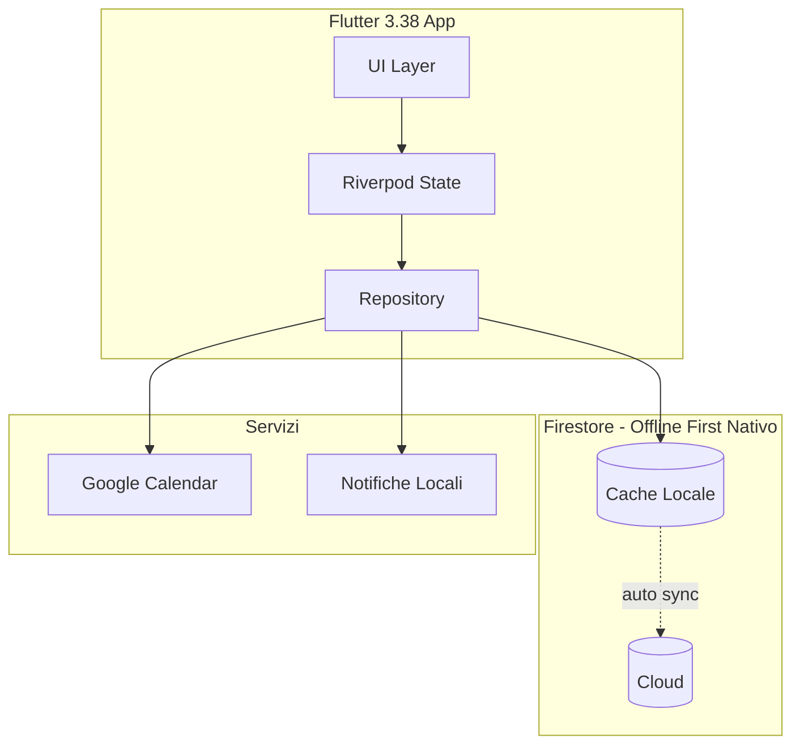

# InjeCare Plan - Piano di Sviluppo Semplificato

## Stack Tecnologico

| Componente | Tecnologia | Note ||------------|------------|------|| Framework | Flutter 3.38+ / Dart 3.10+ | Impeller, Dot Shorthands || Database | Firestore + Persistenza Offline | Nativo, no sync engine custom || Calendario UI | table_calendar | Leggero, personalizzabile || State | Riverpod 2.x | Reattivo, testabile || Auth | Firebase Auth + Google Sign-in | || Notifiche | flutter_local_notifications | |

## Architettura Semplificata



**Vantaggi:**

- Zero sync engine custom - Firestore gestisce tutto
- Conflict resolution automatica
- Meno codice = meno bug
- Persistenza offline abilitata di default su mobile

## Struttura Progetto

```javascript
lib/
├── main.dart
├── app/
│   ├── app.dart
│   └── router.dart
├── core/
│   ├── theme/
│   │   ├── app_colors.dart
│   │   └── app_theme.dart
│   ├── services/
│   │   ├── notification_service.dart
│   │   └── calendar_sync_service.dart
│   └── utils/
├── features/
│   ├── auth/
│   │   ├── auth_repository.dart
│   │   ├── auth_provider.dart
│   │   └── login_screen.dart
│   ├── home/
│   │   ├── home_screen.dart
│   │   └── widgets/
│   │       ├── next_injection_card.dart
│   │       └── stats_card.dart
│   ├── calendar/
│   │   ├── calendar_screen.dart
│   │   └── injection_calendar.dart
│   ├── injection/
│   │   ├── injection_repository.dart
│   │   ├── injection_provider.dart
│   │   ├── body_map_screen.dart
│   │   ├── zone_detail_screen.dart
│   │   ├── record_screen.dart
│   │   └── widgets/
│   │       ├── body_map_widget.dart
│   │       └── point_history_card.dart
│   ├── history/
│   │   └── history_screen.dart
│   └── settings/
│       └── settings_screen.dart
├── models/
│   ├── injection_record.dart
│   ├── therapy_plan.dart
│   └── body_zone.dart
└── l10n/
```


## Modello Dati Firestore

```javascript
users/{userId}/
├── profile
│   ├── displayName
│   ├── email
│   └── biometricEnabled
├── therapyPlan
│   ├── injectionsPerWeek: 3
│   ├── weekDays: [1, 3, 5]  // Lun, Mer, Ven
│   ├── preferredTime: "20:00"
│   └── startDate
├── bodyZones/{zoneId}
│   ├── zoneName: "Coscia Dx"
│   ├── code: "CD"
│   ├── numberOfPoints: 6
│   └── isEnabled: true
├── blacklistedPoints/{pointCode}        // NUOVO: Punti in blacklist
│   ├── pointCode: "CD-3"
│   ├── pointLabel: "Coscia Dx · 3"
│   ├── zoneId: 1
│   ├── pointNumber: 3
│   ├── reason: "Reazione cutanea ricorrente"
│   ├── blacklistedAt: Timestamp
│   └── notes: "Evitare fino a guarigione"
└── injections/{injectionId}
    ├── zoneId: 1
    ├── pointNumber: 3
    ├── pointCode: "CD-3"
    ├── pointLabel: "Coscia Dx · 3"
    ├── scheduledAt: Timestamp
    ├── completedAt: Timestamp
    ├── status: "completed"
    ├── notes: ""
    ├── sideEffects: []
    └── calendarEventId: ""
```


## Zone di Iniezione

| ID | Codice | Nome | Punti ||----|--------|------|-------|| 1 | CD | Coscia Dx | 6 || 2 | CS | Coscia Sx | 6 || 3 | BD | Braccio Dx | 4 || 4 | BS | Braccio Sx | 4 || 5 | AD | Addome Dx | 4 || 6 | AS | Addome Sx | 4 || 7 | GD | Gluteo Dx | 4 || 8 | GS | Gluteo Sx | 4 |**Formato identificativi:**

- `pointCode`: **CD-3** (database, export)
- `pointLabel`: **Coscia Dx · 3** (UI)

## Dipendenze pubspec.yaml

```yaml
name: injecare_plan
version: 1.0.0+1

environment:
  sdk: ^3.10.0
  flutter: ^3.38.0

dependencies:
  flutter:
    sdk: flutter
  flutter_localizations:
    sdk: flutter

  # State
  flutter_riverpod: ^2.6.0
  riverpod_annotation: ^2.6.0

  # Firebase
  firebase_core: ^3.8.0
  firebase_auth: ^5.3.0
  cloud_firestore: ^5.5.0
  firebase_messaging: ^15.1.0

  # Google
  google_sign_in: ^6.2.0
  googleapis: ^13.2.0

  # Calendario
  table_calendar: ^3.1.2
  intl: ^0.19.0

  # Notifiche
  flutter_local_notifications: ^18.0.0
  timezone: ^0.10.0

  # UI
  flutter_svg: ^2.0.10
  go_router: ^14.6.0

  # Sicurezza
  local_auth: ^2.3.0

  # Export
  pdf: ^3.11.0
  share_plus: ^10.0.0

dev_dependencies:
  flutter_lints: ^5.0.0
  riverpod_generator: ^2.6.0
  build_runner: ^2.4.0
```


## Fasi di Sviluppo

### Fase 1: Setup (1-2 giorni)

- Progetto Flutter 3.38
- Firebase config (Auth, Firestore)
- Theme e design system

### Fase 2: Core (3-4 giorni)

- Login Google
- Modelli dati Firestore
- table_calendar integrazione
- Mappa corpo interattiva

### Fase 3: Features (3-4 giorni)

- Flusso registrazione iniezione
- Storico punti per zona
- Notifiche locali

### Fase 4: Polish (2-3 giorni)

- Google Calendar sync
- Export PDF/CSV
- Testing e bug fix

---

# Design Schermate

## Palette Colori - Rosé Pine

Design system: [rosepinetheme.com](https://rosepinetheme.com/palette/)

### Rosé Pine Dawn (Light Mode - Default)

| Ruolo | Nome | Hex | Uso ||-------|------|-----|-----|| Background | Base | `#faf4ed` | Sfondo principale || Background | Surface | `#fffaf3` | Cards, modali || Background | Overlay | `#f2e9e1` | Elementi sovrapposti || Foreground | Muted | `#9893a5` | Testo disabilitato || Foreground | Subtle | `#797593` | Testo secondario || Foreground | Text | `#575279` | Testo principale || Accent | Love | `#b4637a` | Errori, iniezione saltata || Accent | Gold | `#ea9d34` | Warning, in ritardo || Accent | Rose | `#d7827e` | Link, azioni secondarie || Accent | Pine | `#286983` | Primary, completato || Accent | Foam | `#56949f` | Info, suggerimenti || Accent | Iris | `#907aa9` | Badge, accent || Highlight | Low | `#f4ede8` | Hover, selezione || Highlight | Med | `#dfdad9` | Focus || Highlight | High | `#cecacd` | Active |

### Rosé Pine (Dark Mode)

| Ruolo | Nome | Hex | Uso ||-------|------|-----|-----|| Background | Base | `#191724` | Sfondo principale || Background | Surface | `#1f1d2e` | Cards, modali || Background | Overlay | `#26233a` | Elementi sovrapposti || Foreground | Muted | `#6e6a86` | Testo disabilitato || Foreground | Subtle | `#908caa` | Testo secondario || Foreground | Text | `#e0def4` | Testo principale || Accent | Love | `#eb6f92` | Errori, iniezione saltata || Accent | Gold | `#f6c177` | Warning, in ritardo || Accent | Rose | `#ebbcba` | Link, azioni secondarie || Accent | Pine | `#31748f` | Primary, completato || Accent | Foam | `#9ccfd8` | Info, suggerimenti || Accent | Iris | `#c4a7e7` | Badge, accent || Highlight | Low | `#21202e` | Hover, selezione || Highlight | Med | `#403d52` | Focus || Highlight | High | `#524f67` | Active |

### Mapping Semantico per InjeCare

| Stato Iniezione | Colore Dawn | Colore Dark ||-----------------|-------------|-------------|| Completata | Pine `#286983` | Pine `#31748f` || Programmata | Foam `#56949f` | Foam `#9ccfd8` || In ritardo | Gold `#ea9d34` | Gold `#f6c177` || Saltata | Love `#b4637a` | Love `#eb6f92` || Punto escluso | Muted `#9893a5` | Muted `#6e6a86` |

## 1. Splash Screen

```javascript
┌─────────────────────────────────┐
│                                 │
│                                 │
│                                 │
│         ╭───────────╮           │
│         │   💉📅    │           │
│         ╰───────────╯           │
│                                 │
│        InjeCare Plan            │
│                                 │
│   "La tua terapia, sotto        │
│         controllo."             │
│                                 │
│                                 │
│         ● ○ ○ ○                 │
│                                 │
└─────────────────────────────────┘
```


## 2. Onboarding (3 schermate)

### 2a. Benvenuto

```javascript
┌─────────────────────────────────┐
│                          [Skip] │
│                                 │
│      ┌─────────────────┐        │
│      │   📅            │        │
│      │   Calendario    │        │
│      └─────────────────┘        │
│                                 │
│      Pianifica con cura         │
│                                 │
│   Organizza le tue iniezioni    │
│   con un calendario             │
│   intelligente                  │
│                                 │
│                                 │
│         ● ○ ○                   │
│                                 │
│      [Continua →]               │
└─────────────────────────────────┘
```


### 2b. Rotazione

```javascript
┌─────────────────────────────────┐
│                          [Skip] │
│                                 │
│      ┌─────────────────┐        │
│      │   🧍            │        │
│      │   Mappa Corpo   │        │
│      └─────────────────┘        │
│                                 │
│      Alterna i siti             │
│                                 │
│   Suggerimenti automatici       │
│   per la rotazione ottimale     │
│   dei punti di iniezione        │
│                                 │
│                                 │
│         ○ ● ○                   │
│                                 │
│      [Continua →]               │
└─────────────────────────────────┘
```


### 2c. Inizia

```javascript
┌─────────────────────────────────┐
│                                 │
│                                 │
│      ┌─────────────────┐        │
│      │   🔔            │        │
│      │   Promemoria    │        │
│      └─────────────────┘        │
│                                 │
│      Mai più una dose           │
│      dimenticata                │
│                                 │
│   Ricevi notifiche              │
│   personalizzate per ogni       │
│   iniezione programmata         │
│                                 │
│         ○ ○ ●                   │
│                                 │
│   [Accedi con Google]           │
└─────────────────────────────────┘
```


## 3. Home Dashboard

```javascript
┌─────────────────────────────────┐
│ ☰  InjeCare Plan          👤    │
├─────────────────────────────────┤
│                                 │
│  Ciao, Mario                    │
│                                 │
│  ┌─────────────────────────────┐│
│  │  PROSSIMA INIEZIONE         ││
│  │                             ││
│  │  📅 Oggi, 20:00             ││
│  │                             ││
│  │  🦵 Coscia Dx · 3           ││
│  │     (suggerito)             ││
│  │                             ││
│  │  ┌─────────────────────┐    ││
│  │  │   Registra ora  →   │    ││
│  │  └─────────────────────┘    ││
│  └─────────────────────────────┘│
│                                 │
│  Aderenza ultimi 30 giorni      │
│  ┌─────────────────────────────┐│
│  │  ████████████░░  92%        ││
│  │  11/12 iniezioni            ││
│  └─────────────────────────────┘│
│                                 │
│  ┌─────────┐ ┌─────────┐        │
│  │ 📅      │ │ 📊      │        │
│  │Calendario│ │ Storico │        │
│  └─────────┘ └─────────┘        │
│                                 │
├─────────────────────────────────┤
│  🏠    📅    💉    ⚙️           │
│ Home  Cal  Nuova  Imp           │
└─────────────────────────────────┘
```


## 4. Calendario

```javascript
┌─────────────────────────────────┐
│ ←  Gennaio 2026                 │
├─────────────────────────────────┤
│  L   M   M   G   V   S   D      │
│                                 │
│            1   2   3   4   5    │
│                ●               │
│  6   7   8   9  10  11  12     │
│      ●       ●                 │
│ 13  14  15  16  17  18  19     │
│      ●       ●       ○         │
│ 20  21  22  23  24  25  26     │
│      ○       ○                 │
│ 27  28  29  30  31             │
│                                 │
├─────────────────────────────────┤
│  Legenda:                       │
│  ● Completata  ○ Programmata    │
│  ⚠ In ritardo  ✕ Saltata        │
├─────────────────────────────────┤
│  Oggi - 2 Gennaio               │
│  ┌─────────────────────────────┐│
│  │ ○ 20:00                     ││
│  │   Coscia Dx · 3 (suggerito) ││
│  │                    [Vai →]  ││
│  └─────────────────────────────┘│
│                                 │
├─────────────────────────────────┤
│  🏠    📅    💉    ⚙️           │
└─────────────────────────────────┘
```


## 5. Mappa Corpo

```javascript
┌─────────────────────────────────┐
│ ←  Seleziona zona               │
├─────────────────────────────────┤
│                                 │
│         ┌─────────┐             │
│         │    👤    │             │
│    ┌────┤         ├────┐        │
│    │ 3  │         │  4 │  Bracci│
│    └────┤         ├────┘        │
│         │  5 │ 6  │       Addome│
│         │────┼────│             │
│         │    │    │             │
│    ┌────┤    │    ├────┐        │
│    │ 1  │    │    │  2 │  Cosce │
│    └────┤    │    ├────┘        │
│         │    │    │             │
│         │ 7  │  8 │       Glutei│
│         └────┴────┘             │
│                                 │
├─────────────────────────────────┤
│  Zone disponibili:              │
│                                 │
│  ┌──────────┐ ┌──────────┐      │
│  │🦵 Coscia │ │🦵 Coscia │      │
│  │   Dx     │ │   Sx     │      │
│  │ 6 punti  │ │ 6 punti  │      │
│  └──────────┘ └──────────┘      │
│                                 │
│  ┌──────────┐ ┌──────────┐      │
│  │💪 Braccio│ │💪 Braccio│      │
│  │   Dx     │ │   Sx     │      │
│  │ 4 punti  │ │ 4 punti  │      │
│  └──────────┘ └──────────┘      │
│                                 │
└─────────────────────────────────┘
```


## 6. Dettaglio Zona - Storico Punti

```javascript
┌─────────────────────────────────┐
│ ←  Coscia Destra                │
├─────────────────────────────────┤
│                                 │
│  🦵 Coscia Dx                   │
│  5 punti disponibili (1 escluso)│
│                                 │
│  Suggerito: Punto 4             │
│  (non usato da 18 giorni)       │
│                                 │
├─────────────────────────────────┤
│  Storico punti (dal meno usato) │
│                                 │
│  ┌─────────────────────────────┐│
│  │ 🟢 CD-4  Coscia Dx · 4      ││
│  │    Ultima: 15 dic 2025      ││
│  │    18 giorni fa        ⋮    ││
│  │                   [Usa →]   ││
│  └─────────────────────────────┘│
│                                 │
│  ┌─────────────────────────────┐│
│  │ 🟡 CD-1  Coscia Dx · 1      ││
│  │    Ultima: 22 dic 2025      ││
│  │    11 giorni fa        ⋮    ││
│  │                   [Usa →]   ││
│  └─────────────────────────────┘│
│                                 │
│  ┌─────────────────────────────┐│
│  │ 🟠 CD-6  Coscia Dx · 6      ││
│  │    Ultima: 29 dic 2025      ││
│  │    4 giorni fa         ⋮    ││
│  │                   [Usa →]   ││
│  └─────────────────────────────┘│
│                                 │
│  ┌─────────────────────────────┐│
│  │ 🔴 CD-3  Coscia Dx · 3      ││
│  │    Ultima: Oggi        ⋮    ││
│  │    Appena usato             ││
│  └─────────────────────────────┘│
│                                 │
├─────────────────────────────────┤
│  PUNTI ESCLUSI (blacklist)      │
│                                 │
│  ┌─────────────────────────────┐│
│  │ ⛔ CD-2  Coscia Dx · 2      ││
│  │    Motivo: Cicatrice        ││
│  │              [Riabilita →]  ││
│  └─────────────────────────────┘│
│                                 │
└─────────────────────────────────┘
```


### Menu contestuale punto (⋮)

```javascript
┌─────────────────────┐
│ Usa questo punto    │
├─────────────────────┤
│ Vedi storico        │
├─────────────────────┤
│ ⛔ Escludi punto    │
└─────────────────────┘
```


### Dialog Esclusione Punto

```javascript
┌─────────────────────────────────┐
│        Escludi punto            │
├─────────────────────────────────┤
│                                 │
│  Stai per escludere:            │
│  🦵 Coscia Dx · 2 (CD-2)        │
│                                 │
│  Motivo (opzionale):            │
│  ┌─────────────────────────────┐│
│  │ ○ Reazione cutanea          ││
│  │ ○ Cicatrice / lesione       ││
│  │ ○ Difficile da raggiungere  ││
│  │ ○ Altro...                  ││
│  └─────────────────────────────┘│
│                                 │
│  Note:                          │
│  ┌─────────────────────────────┐│
│  │                             ││
│  └─────────────────────────────┘│
│                                 │
│  ┌──────────┐  ┌──────────────┐ │
│  │ Annulla  │  │   Escludi    │ │
│  └──────────┘  └──────────────┘ │
└─────────────────────────────────┘
```


## 7. Registra Iniezione

```javascript
┌─────────────────────────────────┐
│ ←  Registra iniezione           │
├─────────────────────────────────┤
│                                 │
│  📅 2 Gennaio 2026, 20:15       │
│                                 │
│  ┌─────────────────────────────┐│
│  │  🦵 Coscia Dx · 4           ││
│  │     CD-4                    ││
│  └─────────────────────────────┘│
│                    [Cambia]     │
│                                 │
├─────────────────────────────────┤
│  Note (opzionale)               │
│  ┌─────────────────────────────┐│
│  │                             ││
│  │                             ││
│  └─────────────────────────────┘│
│                                 │
│  Effetti collaterali            │
│                                 │
│  ☐ Rossore nel punto            │
│  ☐ Dolore locale                │
│  ☐ Stanchezza                   │
│  ☐ Sintomi influenzali          │
│  ☐ Altro...                     │
│                                 │
│                                 │
│  ┌─────────────────────────────┐│
│  │                             ││
│  │    ✓ Conferma iniezione     ││
│  │                             ││
│  └─────────────────────────────┘│
│                                 │
└─────────────────────────────────┘
```


## 8. Impostazioni

```javascript
┌─────────────────────────────────┐
│ ←  Impostazioni                 │
├─────────────────────────────────┤
│                                 │
│  PIANO TERAPEUTICO              │
│  ┌─────────────────────────────┐│
│  │ Iniezioni settimanali    3 >││
│  ├─────────────────────────────┤│
│  │ Giorni: Lun, Mer, Ven      >││
│  ├─────────────────────────────┤│
│  │ Orario preferito    20:00  >││
│  └─────────────────────────────┘│
│                                 │
│  ZONE E PUNTI                   │
│  ┌─────────────────────────────┐│
│  │ Configura zone             >││
│  ├─────────────────────────────┤│
│  │ ⛔ Punti esclusi (3)       >││
│  └─────────────────────────────┘│
│                                 │
│  NOTIFICHE                      │
│  ┌─────────────────────────────┐│
│  │ Promemoria iniezione    🔘  ││
│  ├─────────────────────────────┤│
│  │ Anticipo           30 min  >││
│  ├─────────────────────────────┤│
│  │ Reminder dose saltata   🔘  ││
│  └─────────────────────────────┘│
│                                 │
│  SINCRONIZZAZIONE               │
│  ┌─────────────────────────────┐│
│  │ Google Calendar         🔘  ││
│  └─────────────────────────────┘│
│                                 │
│  ASPETTO                        │
│  ┌─────────────────────────────┐│
│  │ Tema            Automatico >││
│  │   ○ Chiaro (Dawn)           ││
│  │   ○ Scuro (Rosé Pine)       ││
│  │   ● Automatico (sistema)    ││
│  └─────────────────────────────┘│
│                                 │
│  SICUREZZA                      │
│  ┌─────────────────────────────┐│
│  │ Sblocco biometrico      🔘  ││
│  └─────────────────────────────┘│
│                                 │
│  DATI                           │
│  ┌─────────────────────────────┐│
│  │ Esporta storico (PDF)      >││
│  ├─────────────────────────────┤│
│  │ Esporta storico (CSV)      >││
│  ├─────────────────────────────┤│
│  │ Elimina tutti i dati       >││
│  └─────────────────────────────┘│
│                                 │
└─────────────────────────────────┘
```


## 9. Gestione Punti Esclusi

```javascript
┌─────────────────────────────────┐
│ ←  Punti esclusi                │
├─────────────────────────────────┤
│                                 │
│  3 punti attualmente esclusi    │
│  dalla rotazione automatica     │
│                                 │
│  ┌─────────────────────────────┐│
│  │ ⛔ CD-2  Coscia Dx · 2      ││
│  │    Motivo: Cicatrice        ││
│  │    Escluso: 15 nov 2025     ││
│  │             [Riabilita →]   ││
│  └─────────────────────────────┘│
│                                 │
│  ┌─────────────────────────────┐│
│  │ ⛔ BS-3  Braccio Sx · 3     ││
│  │    Motivo: Reazione cutanea ││
│  │    Escluso: 20 dic 2025     ││
│  │             [Riabilita →]   ││
│  └─────────────────────────────┘│
│                                 │
│  ┌─────────────────────────────┐│
│  │ ⛔ AD-1  Addome Dx · 1      ││
│  │    Motivo: Difficile        ││
│  │    Escluso: 28 dic 2025     ││
│  │             [Riabilita →]   ││
│  └─────────────────────────────┘│
│                                 │
│  ───────────────────────────────│
│  Nota: i punti esclusi non      │
│  vengono suggeriti nella        │
│  rotazione automatica ma        │
│  restano selezionabili          │
│  manualmente.                   │
│                                 │
└─────────────────────────────────┘
```

---

## Roadmap Future (non implementare ora)

### IA Locale per Suggerimenti Intelligenti

Utilizzo di un modello di machine learning on-device per migliorare i suggerimenti dei punti di iniezione basandosi sull'analisi dello storico personale.**Obiettivo**: Suggerimenti personalizzati che tengano conto di:

- Pattern di reazioni avverse per zona/punto
- Tempo di recupero ottimale per ogni punto
- Correlazione tra side effects e specifici punti
- Stagionalita e fattori esterni

**Tecnologie candidate**:

- TensorFlow Lite / ML Kit (on-device)
- Core ML (iOS) / NNAPI (Android)
- Modello leggero addestrato su dati anonimi aggregati

**Privacy-first**:

- Elaborazione completamente locale (no dati inviati a server)
- Modello pre-addestrato, fine-tuning locale opzionale
- Utente puo disabilitare i suggerimenti AI

**Possibili output AI**:

- Score di priorita per ogni punto disponibile
- Avvisi predittivi ("Questo punto ha causato reazioni 3 volte su 5")
- Suggerimento rotazione ottimale personalizzata

---

## Note Privacy (GDPR-first)

- Nessun riferimento a "Sclerosi Multipla" o "SM" nella UI