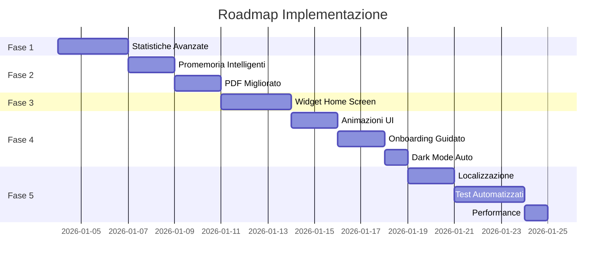

# InjeCare Plan - Roadmap v2.0

## Panoramica Fasi



---

## FASE 1: Statistiche Avanzate (Priorita Alta)

### 1.1 Nuova schermata Statistiche

**File:** `lib/features/statistics/statistics_screen.dart`

- Grafici mensili/annuali con `fl_chart`
- Heatmap zone del corpo (quale zona usata di piu)
- Trend aderenza con linea temporale
- Filtri per periodo (settimana/mese/anno/custom)

### 1.2 Provider Statistiche

**File:** `lib/features/statistics/statistics_provider.dart`

```dart
// Dati calcolati
class InjectionStats {
  final int totalInjections;
  final double adherenceRate;
  final Map<String, int> zoneUsage; // heatmap
  final List<MonthlyData> monthlyTrend;
  final int currentStreak;
  final int longestStreak;
}
```


### 1.3 Widget riutilizzabili

**Files:**

- `lib/features/statistics/widgets/adherence_chart.dart`
- `lib/features/statistics/widgets/zone_heatmap.dart`
- `lib/features/statistics/widgets/trend_line_chart.dart`

### Dipendenze da aggiungere

```yaml
dependencies:
  fl_chart: ^0.69.0
```

---

## FASE 2: Promemoria Intelligenti + PDF

### 2.1 Notifiche Mancate

**File:** `lib/core/services/smart_reminder_service.dart`

- Controlla a fine giornata se iniezione prevista non fatta
- Invia notifica "Hai dimenticato l'iniezione di oggi?"
- Opzione "Salta" o "Registra ora"

### 2.2 Suggerimenti Zona

**File:** `lib/core/services/zone_suggestion_service.dart`

- Calcola tempo dall'ultima iniezione per ogni zona
- Suggerisce la zona meno usata di recente
- Evita zone in blacklist

### 2.3 PDF Report Migliorato

**File:** `lib/core/services/pdf_report_service.dart`

- Intestazione con logo e dati paziente
- Grafici embedded (aderenza, zone)
- Tabella storico formattata
- Footer con data generazione

---

## FASE 3: Widget Home Screen

### 3.1 Android Widget

**Files:**

- `android/app/src/main/kotlin/.../InjeCareWidget.kt`
- `android/app/src/main/res/layout/widget_layout.xml`

### 3.2 iOS Widget (WidgetKit)

**Files:**

- `ios/InjeCareWidget/InjeCareWidget.swift`
- `ios/InjeCareWidget/InjeCareWidgetBundle.swift`

### 3.3 Shared Data

**File:** `lib/core/services/widget_data_service.dart`

- Prossima iniezione programmata
- Aderenza settimana corrente
- Quick action per registrare

---

## FASE 4: UI/UX Polish

### 4.1 Animazioni

- Hero animation su card iniezioni
- Shimmer loading (`shimmer: ^3.0.0`)
- Animated counters per statistiche
- Page transitions con `animations` package

### 4.2 Onboarding Guidato

**File:** `lib/features/onboarding/guided_tour.dart`

- Overlay tutorial con spotlight
- Tooltip contestuali su prima apertura
- Skip/Next navigation
- Salva stato completamento

### 4.3 Dark Mode Automatica

- Opzione "Sistema" in theme selector
- Orario personalizzabile (20:00-07:00)
- Transizione smooth

---

## FASE 5: Tecnico

### 5.1 Localizzazione (i18n)

**Files:**

- `lib/l10n/app_it.arb` (italiano - default)
- `lib/l10n/app_en.arb` (inglese)
- `lib/l10n/app_de.arb` (tedesco)
- `lib/l10n/app_fr.arb` (francese)
- `lib/l10n/app_es.arb` (spagnolo)

### 5.2 Test Automatizzati

**Files:**

- `test/unit/providers/*_test.dart`
- `test/widget/*_screen_test.dart`
- `integration_test/app_test.dart`

### 5.3 Performance

- `cached_network_image` per avatar
- Lazy loading zone con `Riverpod`
- Query ottimizzate con indici DB

---

## File Principali da Creare

| Fase | File | Descrizione ||------|------|-------------|| 1 | `statistics_screen.dart` | Schermata principale stats || 1 | `statistics_provider.dart` | Calcolo metriche || 1 | `adherence_chart.dart` | Grafico aderenza || 1 | `zone_heatmap.dart` | Heatmap zone || 2 | `smart_reminder_service.dart` | Notifiche intelligenti || 2 | `pdf_report_service.dart` | Report PDF avanzato || 3 | `widget_data_service.dart` | Dati per widget || 4 | `guided_tour.dart` | Tutorial onboarding || 5 | `app_*.arb` | File traduzioni |---

## Dipendenze Totali

```yaml
dependencies:
  fl_chart: ^0.69.0           # Grafici
  shimmer: ^3.0.0             # Loading shimmer
  cached_network_image: ^3.4.1 # Cache immagini
  flutter_localizations:
    sdk: flutter
  intl: any

dev_dependencies:
  mocktail: ^1.0.4            # Mocking per test
  integration_test:
    sdk: flutter


```