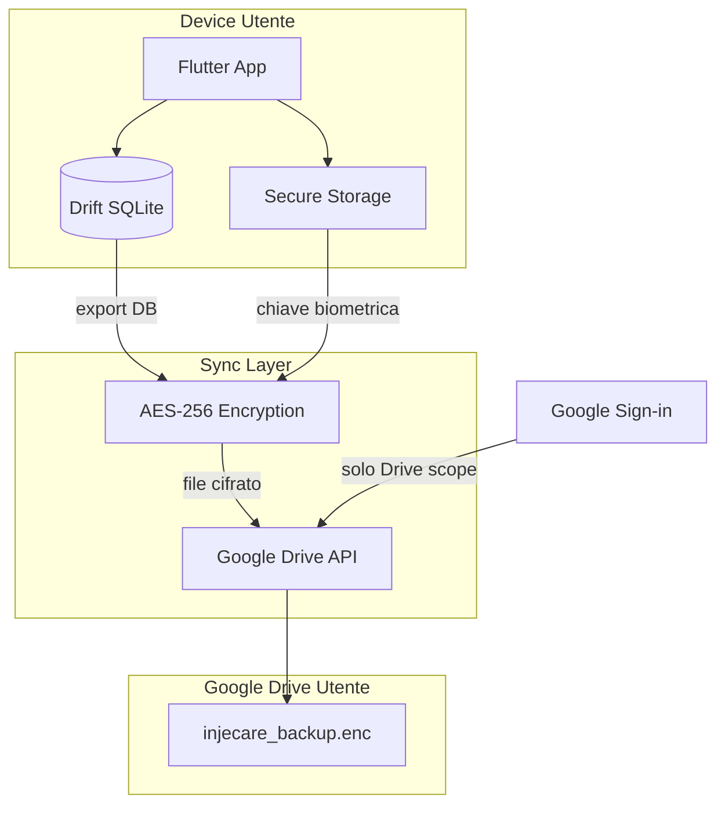
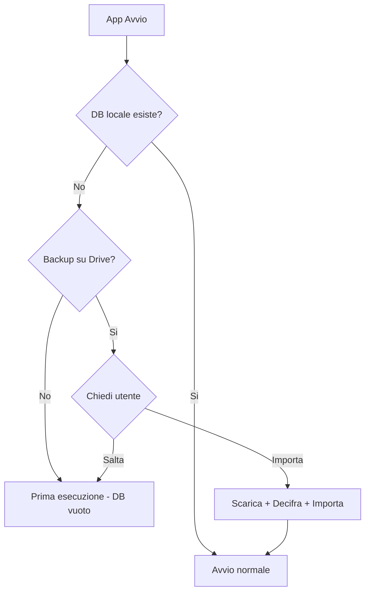

# Migrazione Privacy-First: Firebase to Drift + Google Drive

## Architettura Target




## Cosa Cambia

| Componente | Prima (Firebase) | Dopo (Privacy-First) ||------------|-----------------|----------------------|| Database | Firestore (cloud) | Drift/SQLite (locale) || Auth | Firebase Auth | Google Sign-in (solo per Drive) || Backup | Automatico su Firebase | Google Drive utente (cifrato) || Chiave cifratura | Gestita da Google | Derivata da biometrico utente || Accesso dati | Tu + Google | Solo utente |

## File da Modificare/Creare

### Rimuovere

- `lib/firebase_options.dart`
- `lib/core/services/firebase_service.dart`
- Dipendenze Firebase da `pubspec.yaml`

### Creare Nuovi

- `lib/core/database/` - Schema Drift e DAO
- `lib/core/services/backup_service.dart` - Sync Google Drive
- `lib/core/services/crypto_service.dart` - Cifratura E2E

### Modificare

- `lib/main.dart` - Inizializzazione Drift
- `lib/features/auth/` - Semplificare per solo Drive
- `lib/features/injection/` - Usare Drift invece di Firestore
- `lib/features/settings/` - Aggiungere UI backup/restore

---

## Fasi di Implementazione

### Fase 1: Setup Drift Database

Creare schema database in [`lib/core/database/app_database.dart`](lib/core/database/app_database.dart):

```dart
// Tabelle: injections, body_zones, blacklisted_points, therapy_plan, settings
@DriftDatabase(tables: [Injections, BodyZones, BlacklistedPoints, TherapyPlans])
class AppDatabase extends _$AppDatabase {
  AppDatabase() : super(_openConnection());

  @override
  int get schemaVersion => 1;
}
```


### Fase 2: Crypto Service

Implementare cifratura AES-256 con chiave derivata da biometrico in [`lib/core/services/crypto_service.dart`](lib/core/services/crypto_service.dart):

- Genera chiave al primo accesso biometrico
- Salva chiave in flutter_secure_storage
- Cifra/decifra file backup

### Fase 3: Google Drive Backup Service

Implementare sync in [`lib/core/services/backup_service.dart`](lib/core/services/backup_service.dart):

- Export: SQLite DB -> Cifra -> Upload a Drive
- Import: Download da Drive -> Decifra -> Sostituisci DB
- Auto-sync periodico opzionale

### Fase 4: Import Automatico all'Avvio

Implementare logica in [`lib/main.dart`](lib/main.dart) e [`lib/core/services/startup_service.dart`](lib/core/services/startup_service.dart):




- All'avvio: controlla se esiste DB locale
- Se non esiste: verifica se c'e' backup su Google Drive
- Se esiste backup: chiedi all'utente se importare
- Mostra dialog: "Trovato backup del [data]. Vuoi ripristinarlo?"
- Gestisci errori di decifratura (chiave diversa)

### Fase 5: Rimuovere Firebase

- Eliminare dipendenze Firebase da pubspec.yaml
- Rimuovere file di configurazione Firebase
- Aggiornare AndroidManifest.xml e Info.plist

### Fase 6: Aggiornare Repository e Provider

Modificare [`lib/features/injection/injection_repository.dart`](lib/features/injection/injection_repository.dart) per usare Drift DAO invece di Firestore.

### Fase 7: UI Backup/Restore

Aggiungere sezione in Settings per:

- Backup manuale
- Restore da backup
- Stato ultimo sync
- Toggle auto-sync

---

## Strategia Git Commit

Ogni fase viene committata separatamente per tracciabilita:

1. `feat(db): setup Drift database schema and DAOs`
2. `feat(crypto): implement E2E encryption with biometric key`
3. `feat(backup): implement Google Drive backup service`
4. `feat(startup): implement automatic backup import on first run`
5. `refactor: remove Firebase dependencies`
6. `refactor(repo): migrate repositories from Firestore to Drift`
7. `feat(ui): add backup/restore UI in settings`

---

## Dipendenze da Aggiungere

```yaml
dependencies:
  # Database
  drift: ^2.26.0
  sqlite3_flutter_libs: ^0.5.28
  path_provider: ^2.1.4
  path: ^1.9.0

  # Crypto
  encrypt: ^5.0.3
  flutter_secure_storage: ^9.2.4
  local_auth: ^3.0.0  # gia presente

  # Google Drive
  google_sign_in: ^7.2.0  # gia presente
  googleapis: ^15.0.0  # gia presente
  extension_google_sign_in_as_googleapis_auth: ^2.0.12

dev_dependencies:
  drift_dev: ^2.26.0
  build_runner: ^2.4.15  # gia presente
```


## Dipendenze da Rimuovere

```yaml
# RIMUOVERE
firebase_core: ...
firebase_auth: ...
cloud_firestore: ...
firebase_messaging: ...


```