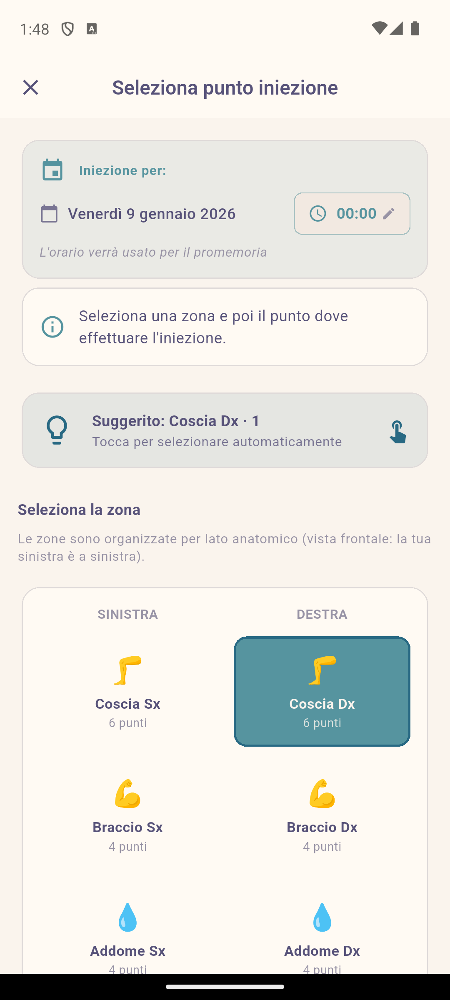

# InjeCare Plan

> La tua terapia, sotto controllo.

Applicazione Flutter per la gestione delle iniezioni di Interferone beta-1a per pazienti con terapie iniettive.

[](https://flutter.dev)
[](https://dart.dev)
[](LICENSE)
[](https://github.com/WaYdotNET/inje-care-plan)

**Developed by [Carlo Bertini](https://waydotnet.com) (WaYdotNET)**

- 📖 **[Manuale Utente](docs/MANUALE_UTENTE.md)** - Guida dettagliata con screenshot
- 🏗️ **[Architettura](docs/ARCHITECTURE.md)** - Documentazione tecnica

## Screenshots

<p align="center">
  
  
  
  
</p>

## Caratteristiche

### Core
- 📅 **Calendario intelligente**: Pianificazione automatica delle iniezioni
- 🧍 **Mappa corpo interattiva**: 8 zone con rotazione automatica dei punti
- 📜 **Storico punti**: Visualizza l'ultimo utilizzo di ogni punto con indicatori colorati (verde=consigliato, rosso=evitare)
- 🔄 **Pattern di rotazione configurabili**: 7 metodi per ruotare le zone
  - Suggerimento AI (predefinito)
  - Sequenza zone fissa
  - Alternanza sinistra/destra
  - Rotazione settimanale per tipo
  - Rotazione oraria del corpo
  - Rotazione antioraria del corpo
  - Sequenza personalizzata drag-and-drop
- 🏠 **Due stili di Home**: Scegli la visualizzazione preferita
  - Classica: Vista completa con statistiche e azioni rapide
  - Minimalista: Solo prossima iniezione con silhouette interattiva
- 🔔 **Promemoria avanzati**: Notifiche configurabili
- 📊 **Statistiche avanzate**: Grafici aderenza, heatmap zone, trend settimanali
- 🤖 **Suggerimenti AI**: Raccomandazioni intelligenti per zone e orari
- 📤 **Export PDF/CSV**: Condivisione report con il medico
- 📥 **Import CSV**: Importazione storico da file esterno
- 🎯 **Dati demo**: Opzione per provare l'app con dati di esempio

### Privacy-First (Offline-Only)
- 🔒 **100% Offline**: Tutti i dati restano sul tuo dispositivo
- 🛡️ **Nessun cloud**: Nessuna dipendenza da servizi esterni
- 👁️ **Privacy UI**: Nessun riferimento esplicito alla patologia
- 📥 **Import/Export CSV**: Formato semplice per backup e migrazione

## Stack Tecnologico

| Componente | Tecnologia |
|------------|------------|
| Framework | Flutter 3.38+ / Dart 3.10+ |
| Database | Drift (SQLite) - offline-first |
| State | Riverpod 3.x |
| Routing | go_router |
| Notifiche | flutter_local_notifications |
| Grafici | fl_chart |
| Calendario | table_calendar |

## Requisiti

- Flutter SDK **3.38.5 (stable consigliato)**
- Dart SDK **3.10.0+** (anche pre-release compatibili)
- Android 5.0+ o iOS 12.0+

## Test

Il progetto include una suite completa di test:

```bash
# Esegui tutti i test
flutter test

# Test con copertura
flutter test --coverage
```

**Copertura dei test: 100%** (su file non generati)
- **642 test** totali
- Unit test per modelli (`BodyZone`, `TherapyPlan`, `InjectionRecord`)
- Unit test per provider (`AuthProvider`, `InjectionProvider`, `ZoneProvider`, `StatisticsProvider`)
- Unit test per algoritmi ML (`ZonePredictionModel`, `TimeOptimizer`, `AdherenceScorer`)
- Unit test per servizi (`CryptoService`, `ExportService`, `SmartReminderService`)
- Unit test per database (`AppDatabase` DAO methods)
- Widget test per componenti UI (`ShimmerLoading`, `AnimatedCounter`, `CommonWidgets`)
- Test per temi (`AppTheme`, `AppColors`)

## Setup

### 1. Clona il repository

```bash
git clone https://github.com/WaYdotNET/inje-care-plan.git
cd inje-care-plan
```

### 2. Installa le dipendenze

```bash
flutter pub get
```

### 3. Genera il codice Drift

```bash
dart run build_runner build --delete-conflicting-outputs
```

### 4. Esegui l'app

```bash
flutter run
```

## Struttura Progetto

```
lib/
├── app/                    # Router e configurazione
├── core/
│   ├── database/           # Drift database
│   ├── ml/                 # Algoritmi ML/suggerimenti
│   ├── services/           # Notifiche, export, etc.
│   ├── theme/              # Tema Rosé Pine
│   └── widgets/            # Widget riutilizzabili
├── features/
│   ├── auth/               # Onboarding
│   ├── calendar/           # Vista calendario
│   ├── history/            # Storico iniezioni
│   ├── home/               # Dashboard
│   ├── injection/          # Registrazione iniezioni
│   ├── settings/           # Impostazioni
│   └── statistics/         # Statistiche avanzate
└── models/                 # Modelli dati
```

## Zone di Iniezione

| Codice | Nome | Punti |
|--------|------|-------|
| CD | Coscia Dx | 6 |
| CS | Coscia Sx | 6 |
| BD | Braccio Dx | 4 |
| BS | Braccio Sx | 4 |
| AD | Addome Dx | 4 |
| AS | Addome Sx | 4 |
| GD | Gluteo Dx | 4 |
| GS | Gluteo Sx | 4 |

**Totale: 36 punti** con rotazione automatica.

## Design System

L'app utilizza la palette [Rosé Pine](https://rosepinetheme.com/palette/):
- **Light Mode**: Rosé Pine Dawn
- **Dark Mode**: Rosé Pine

## Localizzazione

Lingue supportate:
- 🇮🇹 Italiano (default)
- 🇬🇧 English
- 🇩🇪 Deutsch
- 🇫🇷 Français
- 🇪🇸 Español

## Autore

**Carlo Bertini** (WaYdotNET)
- 🌐 Website: [waydotnet.com](https://waydotnet.com)
- 📦 Repository: [github.com/WaYdotNET/inje-care-plan](https://github.com/WaYdotNET/inje-care-plan)

## Versione Web e sito per utenti

- **Sito per utenti + guida**: `https://waydotnet.github.io/inje-care-plan/`
- **Versione Web (app)**: `https://waydotnet.github.io/inje-care-plan/app/`

> Se stai usando un fork, l’URL cambia in base al tuo username e al nome del repository.

## Licenza

Questo progetto è rilasciato sotto licenza **GNU General Public License v3.0**.

Vedi il file [LICENSE](LICENSE) per i dettagli completi.

```
InjeCare Plan - App per gestione terapie iniettive
Copyright (C) 2024-2026 Carlo Bertini (WaYdotNET)

This program is free software: you can redistribute it and/or modify
it under the terms of the GNU General Public License as published by
the Free Software Foundation, either version 3 of the License, or
(at your option) any later version.
```
