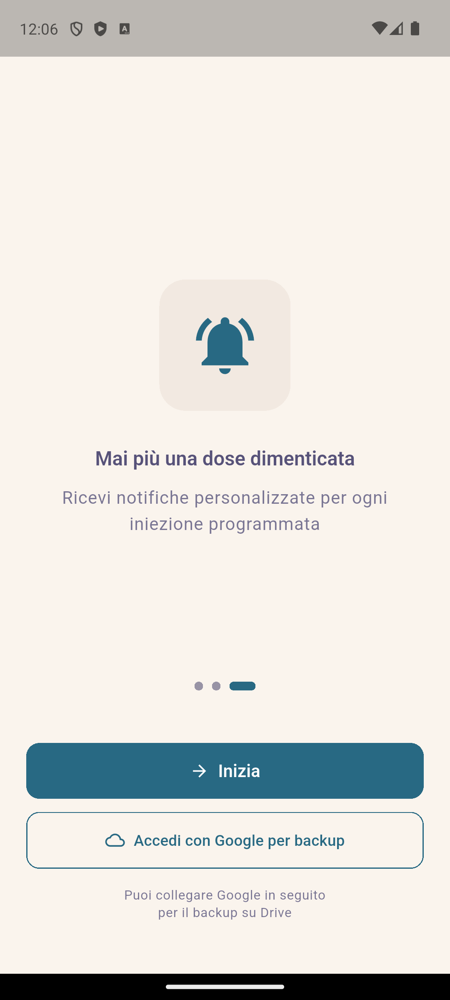
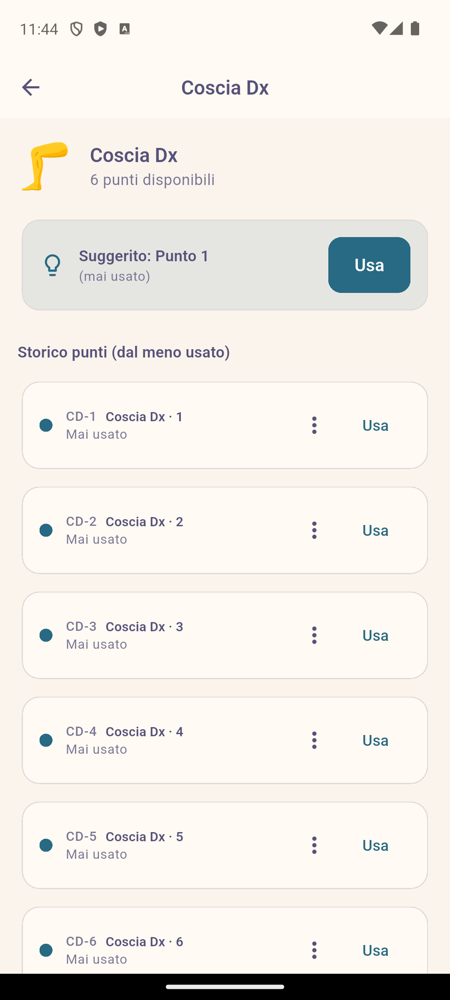
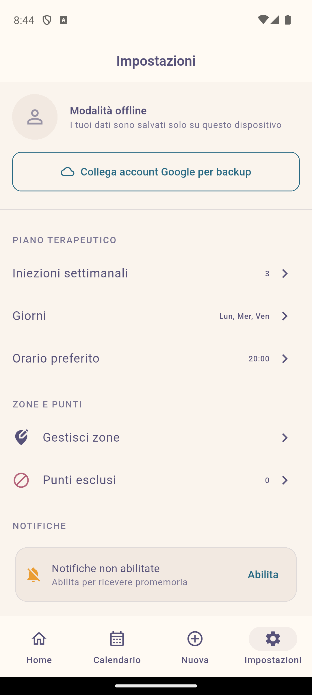

# Manuale Utente - InjeCare Plan

> La tua terapia, sotto controllo.

---

## Indice

1. [Introduzione](#introduzione)
2. [Primo Avvio](#primo-avvio)
3. [Dashboard Home](#dashboard-home)
4. [Registrare un'Iniezione](#registrare-uniniezione)
5. [Calendario](#calendario)
6. [Storico](#storico)
7. [Impostazioni](#impostazioni)
8. [Privacy e Sicurezza](#privacy-e-sicurezza)
9. [Domande Frequenti (FAQ)](#domande-frequenti-faq)

---

## Introduzione

**InjeCare Plan** è un'applicazione progettata per aiutarti a gestire la tua terapia iniettiva in modo semplice, sicuro e completamente privato.

### Caratteristiche Principali

- **Calendario intelligente**: Pianifica automaticamente le tue iniezioni
- **Mappa del corpo interattiva**: Ruota i punti di iniezione per evitare sovrapposizioni
- **Promemoria configurabili**: Non dimenticare mai una dose
- **Storico completo**: Tieni traccia di tutte le iniezioni
- **100% Offline**: I tuoi dati restano sul tuo dispositivo
- **Backup cifrato**: Opzionale, su Google Drive con password

---

## Primo Avvio

Al primo avvio dell'app, vedrai una breve introduzione alle funzionalità principali.

  

### Opzioni di Avvio

1. **"Inizia"** - Usa l'app completamente offline, senza account Google. I tuoi dati restano solo sul dispositivo.

2. **"Accedi con Google per backup"** - Collega il tuo account Google per abilitare il backup cifrato su Google Drive.

> **Nota**: Puoi sempre collegare Google in seguito dalle Impostazioni.

---

## Dashboard Home

Dopo il primo avvio, verrai accolto dalla schermata principale.

  

### Elementi della Dashboard

| Elemento | Descrizione |
|----------|-------------|
| **Prossima Iniezione** | Data, ora e punto suggerito per la prossima iniezione |
| **Registra ora** | Pulsante rapido per registrare l'iniezione |
| **Aderenza** | Percentuale di aderenza negli ultimi 30 giorni |
| **Calendario** | Accesso rapido alla vista calendario |
| **Storico** | Accesso rapido allo storico iniezioni |

### Barra di Navigazione

In basso trovi quattro schede:
- **Home** - Dashboard principale
- **Calendario** - Vista mensile delle iniezioni
- **Nuova** - Registra una nuova iniezione
- **Impostazioni** - Configura l'app

---

## Registrare un'Iniezione

### Passo 1: Seleziona la Zona

Tocca "Registra ora" o "Nuova" per aprire la mappa del corpo.

  

Il corpo è diviso in **8 zone**:

| Codice | Nome | Punti |
|--------|------|-------|
| CD | Coscia Destra | 6 |
| CS | Coscia Sinistra | 6 |
| BD | Braccio Destro | 4 |
| BS | Braccio Sinistro | 4 |
| AD | Addome Destro | 4 |
| AS | Addome Sinistro | 4 |
| GD | Gluteo Destro | 4 |
| GS | Gluteo Sinistro | 4 |

La zona **suggerita** è evidenziata in base alla rotazione automatica.

### Passo 2: Seleziona il Punto

Tocca una zona per vedere i punti disponibili.

  

- **Punti verdi**: Disponibili
- **Punti arancioni**: Usati di recente
- **Punti rossi**: Esclusi (blacklist)

Tocca **"Usa"** sul punto desiderato.

### Passo 3: Conferma l'Iniezione

  

In questa schermata puoi:

1. **Confermare** il punto selezionato
2. **Aggiungere note** (opzionale)
3. **Segnalare effetti collaterali** (opzionale)
4. **Salvare** l'iniezione

Dopo il salvataggio, l'app:
- Aggiorna lo storico
- Ricalcola la prossima iniezione suggerita
- Programma il prossimo promemoria

---

## Calendario

La vista calendario mostra tutte le iniezioni programmate e completate.

  

### Legenda Colori

- **Blu**: Iniezione programmata (futura)
- **Verde**: Iniezione completata
- **Rosso**: Iniezione saltata
- **Grigio**: Giorno senza iniezioni

### Interazioni

- **Tocca un giorno**: Vedi i dettagli delle iniezioni
- **Scorri sinistra/destra**: Cambia mese
- **Tocca un evento**: Apri i dettagli

---

## Storico

Lo storico mostra tutte le iniezioni passate in ordine cronologico.

  

### Funzionalità

- **Filtri**: Filtra per periodo, stato o zona
- **Dettagli**: Tocca un'iniezione per vedere i dettagli
- **Export**: Esporta in PDF o CSV (icona in alto a destra)

### Formato Export

Il report esportato include:
- Data e ora di ogni iniezione
- Punto utilizzato
- Note ed effetti collaterali
- Statistiche di aderenza

Ideale per condividere con il tuo neurologo.

---

## Impostazioni

  

### Sezioni Impostazioni

#### Modalità Offline / Account Google

- **Modalità offline**: I dati sono salvati solo sul dispositivo
- **Collega account Google**: Abilita backup cifrato su Drive

#### Piano Terapeutico

| Opzione | Descrizione |
|---------|-------------|
| **Iniezioni settimanali** | Numero di iniezioni a settimana (default: 3) |
| **Giorni** | Giorni della settimana (es. Lun, Mer, Ven) |
| **Orario preferito** | Ora promemoria (es. 20:00) |

#### Zone e Punti

- **Configura zone**: Personalizza le zone del corpo
- **Punti esclusi**: Gestisci i punti in blacklist

  

> **Punti Esclusi**: Puoi escludere punti che causano reazioni, hanno cicatrici o sono difficili da raggiungere. I punti esclusi non vengono suggeriti automaticamente ma restano selezionabili manualmente.

#### Notifiche

| Opzione | Descrizione |
|---------|-------------|
| **Promemoria iniezione** | Attiva/disattiva promemoria |
| **Anticipo** | Minuti prima dell'orario (es. 30 min) |

---

## Backup e Ripristino

### Creare un Backup

1. Vai in **Impostazioni**
2. Collega il tuo account Google (se non già fatto)
3. Scorri fino a **Backup e Ripristino**
4. Tocca **"Backup su Google Drive"**
5. Inserisci una **password sicura** (minimo 8 caratteri)
6. Conferma

Il backup viene cifrato con AES-256 prima di essere caricato su Drive.

### Ripristinare su Nuovo Dispositivo

1. Installa InjeCare Plan sul nuovo dispositivo
2. Accedi con lo stesso account Google
3. L'app rileva automaticamente il backup esistente
4. Inserisci la **stessa password** usata per il backup
5. I dati vengono ripristinati

> **IMPORTANTE**: La password non viene mai salvata. Se la dimentichi, non potrai recuperare il backup.

---

## Privacy e Sicurezza

### Dati Locali

- Tutti i dati sono salvati **localmente** sul dispositivo
- Utilizziamo **SQLite** (Drift) per massima affidabilità
- Nessun dato viene inviato a server esterni

### Backup Cifrato

- Cifratura **AES-256** con chiave derivata dalla password
- La chiave usa **PBKDF2** con 100.000 iterazioni
- Il backup su Drive contiene solo dati cifrati

### Privacy nell'Interfaccia

- L'app **non mostra riferimenti espliciti** alla patologia
- Ideale per utilizzo in pubblico
- Possibilità di sblocco biometrico

---

## Domande Frequenti (FAQ)

### Posso usare l'app senza account Google?

**Sì!** L'app funziona completamente offline. L'account Google è opzionale e serve solo per il backup su Drive.

### Cosa succede se dimentico la password del backup?

Purtroppo **non è possibile recuperare il backup** senza la password corretta. Questo è intenzionale per garantire la massima sicurezza dei tuoi dati.

### Posso esportare i dati per il mio medico?

**Sì!** Vai in Storico e tocca l'icona di export in alto a destra. Puoi generare un PDF o CSV con tutto lo storico.

### L'app funziona su tablet?

**Sì!** L'interfaccia si adatta automaticamente a schermi più grandi.

### I dati sono sincronizzati tra dispositivi?

Solo se usi il backup su Google Drive. Il backup è manuale: devi fare backup sul dispositivo originale e ripristino sul nuovo dispositivo.

### Posso modificare le zone di iniezione?

**Sì!** Vai in Impostazioni → Configura zone per personalizzare le zone e i punti.

### L'app invia notifiche?

**Sì!** Puoi configurare promemoria per ogni iniezione. Le notifiche sono locali e non richiedono connessione internet.

---

## Supporto

Per segnalare bug o richiedere funzionalità:

- **GitHub Issues**: [github.com/WaYdotNET/inje-care-plan/issues](https://github.com/WaYdotNET/inje-care-plan/issues)
- **Website**: [waydotnet.com](https://waydotnet.com)

---

**InjeCare Plan** - Sviluppato con ❤️ da Carlo Bertini (WaYdotNET)

Licenza: GPL-3.0

